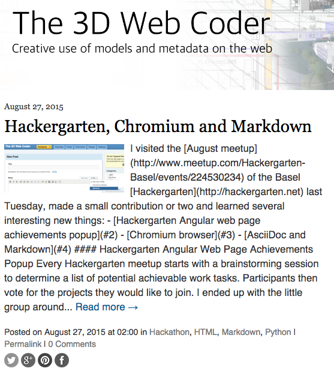

<head>
<title>The 3D Web Coder</title>
<meta http-equiv="Content-Type" content="text/html; charset=utf-8"/>
<link rel="stylesheet" type="text/css" href="3dwc.css"/>

<!--

-->
</head>

<!---

- asciidoc - use asciidoc to write html and other docs, maybe also slide shows using slidy

- asciidoc easy web site framework

#3dwebcoder #python #adskdevnetwrk #adsk #markdown #asciidoc
#gcal #caldav #cloud #googleapi #restapi
#nodejs #revitapi #mongodb #mongolab #heroku
#mongoosejs #expressjs
#milanojs
#3dwebaccel #prague #webgl #3dweb #a360
#au2015 #autocad #inventor #ah8 #cubeathens #developers
#aws #revitapi #jquery #handlebars #heroku
akn_include

-->

### Hackergarten, Chromium and Markdown

I visited the
[August meetup](http://www.meetup.com/Hackergarten-Basel/events/224530234) of the Basel
[Hackergarten](http://hackergarten.net) last Tuesday, made a small contribution or two and learned several interesting new things:

- [Hackergarten Angular web page achievements popup](#2)
- [Chromium browser](#3)
- [AsciiDoc and Markdown](#4)

#### Hackergarten Angular Web Page Achievements Popup

Every Hackergarten meetup starts with a brainstorming session to determine a list of potential achievable work tasks.

Participants then vote for the projects they would like to join.

I ended up with the little group around [@victorparmar](https://github.com/victorparmar) working on two issues related to the hackergarten web site itself:

- Added details modal for hackergarten events to main website.
- Fixed past event date sorting on hackergarten main website (sort not correctly displaying in Chrome).

The Hackergarten web site is implemented in Angular and hosted on GitHub, and our enhancements are captured in the
[pull request #46](https://github.com/hackergarten/hackergarten.github.io/pull/46), *adding details modal to events + fixing past event sort order in chrome*.

The sort problem really was a bug, and Firefox does something rather strange to hide it.

Events were being sorted by date like this:

<pre class="prettyprint">
  eventList.sort(function (a, b) {
    return new Date(a.date) < new Date(b.date);
  });
</pre>

This should not work, since the sort function expects a compare function returning -1, 0 or +1, not an operator like `<` returning a Boolean value.

We fixed the issue like this:

<pre class="prettyprint">
  eventList.sort(function (a, b) {
    var isLess = new Date(a.date) < new Date(b.date);
    return (isLess ? 1 : -1);
  });
</pre>

#### Chromium Browser

I was aware of the open source [Chromium](https://www.chromium.org) project, its C++ library and the [CefSharp](https://github.com/cefsharp/CefSharp) .NET bindings to embed a web browser in my own application.

I was not aware of the Chromium **browser**, though, similar to the [Google Chrome browser](http://www.google.com/chrome), with a smaller footprint, and completely open source, unlike the Google browser.

Victor was using that, and I installed and started using it as well now.

Both browsers share my cloud-hosted bookmarks, so the switch was very easy.

The only snag I hit so far was lack of support for one specific video format in YouTube &ndash; I simply temporarily switched back to Chrome to watch that.

#### AsciiDoc and Markdown

Ever since I started working on
[The Building Coder](http://thebuildingcoder.typepad.com)
blog in 2008, I have been writing my blog posts in pure handcrafted HTML.

I often thought of using
[Markdown](http://daringfireball.net/projects/markdown)
or some other more lightweight format to avoid some of the syntactic mess and typing effort.

One of the Hackergarten projects was looking at fixing
[issue #165](https://github.com/asciidoctor/asciidoctor-gradle-plugin/issues/166)
integrating [AsciiDoctor](http://asciidoctor.org) into the Gradle documentation workflow.

That prompted me to look at the Python
[AsciiDoc](http://asciidoc.org) project and rekindled my interest in using Markdown to generate the HTML for my blog posts.

This is the first result.

Here are the problem descriptions and solutions to two of the issues I encountered in the process:

- [Adding metadata and comments to the markdown source](http://stackoverflow.com/questions/4823468/store-comments-in-markdown-syntax)
- [Defining a named anchor in markdown](http://stackoverflow.com/questions/5319754/cross-reference-named-anchor-in-markdown)

As an example, here is the Markdown source for this paragraph:

<pre class="prettyprint">
#### &lt;a name="4"&gt;&lt;/a&gt;AsciiDoc and Markdown

Ever since I started working on
[The Building Coder](http://thebuildingcoder.typepad.com)
blog in 2008, I have been writing my blog posts in pure handcrafted HTML.

I often thought of using
[Markdown](http://daringfireball.net/projects/markdown)
or some other more lightweight format to avoid some of the syntactic mess and typing effort.

One of the Hackergarten projects was looking at fixing
[issue #165](https://github.com/asciidoctor/asciidoctor-gradle-plugin/issues/166)
integrating [AsciiDoctor](http://asciidoctor.org) into the Gradle documentation workflow.

That prompted me to look at the Python
[AsciiDoc](http://asciidoc.org) project and rekindled my interest in using Markdown to generate the HTML for my blog posts.

This is the first result.

Here are the problem descriptions and solutions to two of the issues I encountered in the process:

- [Adding metadata and comments to the markdown source](http://stackoverflow.com/questions/4823468/store-comments-in-markdown-syntax)
- [Defining a named anchor in markdown](http://stackoverflow.com/questions/5319754/cross-reference-named-anchor-in-markdown)
</pre>

I promise you that the HTML generated from that is a lot messier and less readable  :-)

I generate it using the [Python Markdown library](https://pythonhosted.org/Markdown) using its [command line interface](https://pythonhosted.org/Markdown/cli.html) like this:

<pre class="prettyprint">
$ markdown_py 0043_md_chromium_hg.md > 0043_md_chromium_hg.html
</pre>

I don't need to do so for the Typepad blog entry, though, because it supports markdown right out of the box:

Oops.

Another problem became apparent after publishing the initial version of this post.

The Typepad automatic excerpt generator does not understand markdown hypertext references:

I guess I will have to switch to HTML for the initial table of contents at the top of the post after all.

I wonder what other surprises are in store for me.

Oops again.

That did not help, so I ended up hand editing the excerpt instead.

And replacing the HTML table of contents by markdown again.

Apparently, once the excerpt has been automatically generated, that's that.

Happily, I can redefine it manually afterwards, at least.

Ah well.
