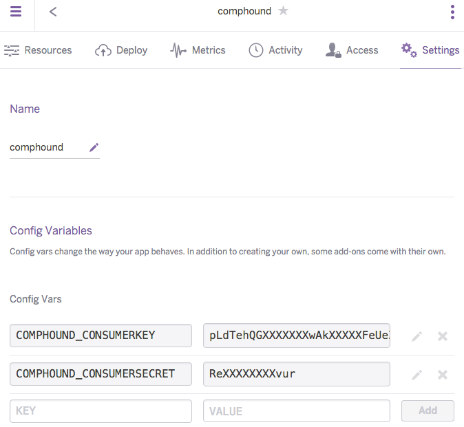

<head>
<title>The 3D Web Coder</title>
<meta http-equiv="Content-Type" content="text/html; charset=utf-8"/>
<link rel="stylesheet" type="text/css" href="3dwc.css"/>

<!--

-->
</head>

<!---

#adskdevnetwrk
#expressjs
#RestSharp
#Autodesk #IoT #SeeControl #cloud
#python #markdown #asciidoc
#gcal #caldav #googleapi
#milanojs
#3dwebaccel #prague #webgl #3dweb #a360
#au2015 #autocad #inventor #ah8 #cubeathens #developers
#aws #handlebars
#javascript
#JsFiddle #Reactjs
#autodesku #rtceur
#Reactjs
#MongoDB
#mongolab #jquery
akn_include

CompHound Viewer and Authorisation Service #Heroku #3dwebcoder #revitapi #nodejs #adsk #ViewAndDataAPI #restapi

I continued working on my CompHound component tracker and now successfully integrated the viewer
&ndash; CompHound updates and the LMV viewer
&ndash; Authorisation token server
&ndash; LMV consumer key and secret environment variables
&ndash; Client-side auth code provider
&ndash; Viewer set-up
&ndash; Wrap-up and next steps...

-->

### CompHound Viewer and Authorisation Service

I continued working on my [CompHound](https://github.com/CompHound) component tracker and now successfully integrated the viewer, just in time to wrap up before leaving for two weeks vacation starting next Monday.

- [CompHound updates and the LMV viewer](#2)
- [Authorisation token server](#3)
- [LMV consumer key and secret environment variables](#3.1)
- [Client-side auth code provider](#4)
- [Viewer set-up](#5)
- [Wrap-up and next steps](#6)

#### CompHound Updates and the LMV Viewer

I finally gave up resisting the pernicious acronym LMV, short for *large model viewer*.

It has always been used as an unofficial internal code name for the Autodesk
[View and Data API](https://developer.autodesk.com) viewer.

No other abbreviation had any success yet, and many colleagues are using LMV, so I'll join the ranks.

Before starting to work on viewer stuff, I fiddled with setting up two columns in the CompHound user interface for the selected component occurrence data and the viewer, but did not complete that yet.

I also consolidated and cleaned up of the three readme files, so that now
the [web server](https://github.com/CompHound/CompHoundWeb)
and [C# client](https://github.com/CompHound/CompHoundRvt) ones
both point clearly straight to
the [landing page](https://github.com/CompHound/CompHound.github.io).

The viewer component uses OAuth 2 authorisation, so it consists of two parts:

- Authorisation token server
- Client-side token access and viewer

On the client side of things, a separate little JavaScript object helps access the authorisation tokens provided by the server.

I will therefore discuss the following three implementation files:

- /lmvauth/AuthTokenServer.js &ndash; the [authorisation token server](#3)
- /public/js/lmvauthtoken.js &ndash; the [client-side auth code provider](#4)
- /public/js/lmviewer.js &ndash; the [viewer set-up](#5)

The latter two are public and pulled in by the user interface defined in `public/datatable2.html`.

#### Authorisation Token Server

I implemented the authorisation server and new REST API routes for it based on
[Jim Awe](https://github.com/JimAwe)'s
[simple AuthTokenServer using Node.js](https://github.com/Developer-Autodesk/AuthTokenServer_Simple).

Its functionality is provided by the `LmvAuthorisationService` defined in `./lmvauth/AuthTokenServer.js`:

<pre class="prettyprint">
// AuthTokenServer.js
// by Jim Awe

var https = require("https");

// Call the Autodesk authentication API to get a token
// based on our client_id and client_secret.
// When we get a response, forward that response on to
// the browser-based app that called us needing the token.

function getAuthCode(mainResponse, baseUrl,
                     clientId, clientSecret)
{
  var dataString =
    "client_id=" + clientId
    + "&client_secret=" + clientSecret
    + "&grant_type=client_credentials";

  var headers = {
    "Content-Type": "application/x-www-form-urlencoded"
  };

  var options = {
    host: baseUrl,
    port: 443,
    path: "/authentication/v1/authenticate",
    method: "POST",
    headers: headers,

    // only for dev!
    rejectUnauthorized: false,
    requestCert: true,
    agent: false
  };

  var req = https.request(options, function(res) {
    res.setEncoding("utf8");
    var responseString = "";

    res.on("data", function (data) {
      responseString += data;
    });

    res.on("end", function() {
      console.log(responseString);
      mainResponse.setHeader('Content-Type', 'application/json');
      mainResponse.setHeader('Access-Control-Allow-Origin', '*');
      mainResponse.send(responseString); // forward response on to the original call from the browser app
    });
  });

  req.write(dataString);
  req.end();
}

// Define entry points for the URLs the browser based
// app will send to us to get the token.  Send one
// appropriate for the given environment.  If you only
// have keys for the PRODUCTION environment, then just
// replace those below, otherwise you can replace them
// all and easily switch environments from your browser
// app.

LmvAuthorisationService = {

  auth : function(req, res) {
    console.log("AuthTokenServer: getting PRODUCTION token...");
    // ***** PUT YOUR PRODUCTION KEYS HERE *****
    getAuthCode(res, "developer.api.autodesk.com",
      process.env.COMPHOUND_CONSUMERKEY,
      process.env.COMPHOUND_CONSUMERSECRET);
  },

  authstg : function(req, res) {
    console.log("AuthTokenServer: getting STAGING token...");
    // ***** PUT YOUR STAGING KEYS HERE *****
    getAuthCode(res, "developer-stg.api.autodesk.com",
      process.env.COMPHOUND_CONSUMERKEY,
      process.env.COMPHOUND_CONSUMERSECRET);
  },

  authdev : function(req, res) {
    // need endpoint and keys for DEV
    console.log("AuthTokenServer: getting DEV token...");
    // ***** PUT YOUR DEV KEYS HERE *****
    getAuthCode(res, "developer-dev.api.autodesk.com",
      process.env.COMPHOUND_CONSUMERKEY,
      process.env.COMPHOUND_CONSUMERSECRET);
  },

  authtest : function(req, res) {
    res.send("LmvAuthorisationService: I'm alive!");
  }

}

module.exports = LmvAuthorisationService;
</pre>

This functionality is made available via the last four public REST API routes defined in `routes.js`:

<pre class="prettyprint">
module.exports = function(app) {
  var InstanceService = require('./controller/instances_v1');
  app.get('/api/v1/instances', InstanceService.findAll);
  app.get('/api/v1/instances/:id', InstanceService.findById);
  app.post('/api/v1/instances', InstanceService.add);
  app.put('/api/v1/instances/:id', InstanceService.update4);
  app.delete('/api/v1/instances/:id', InstanceService.delete);
  app.get('/api/v1/instances/project/:pid', InstanceService.findAllForProject);

  var LmvAuthorisationService = require('./lmvauth/AuthTokenServer');
  app.get('/api/v1/auth', LmvAuthorisationService.auth);
  app.get('/api/v1/auth-stg', LmvAuthorisationService.authstg);
  app.get('/api/v1/auth-dev', LmvAuthorisationService.authdev);
  app.get('/api/v1/auth-test', LmvAuthorisationService.authtest);
}
</pre>

#### LMV Consumer Key and Secret Environment Variables

To avoid publishing my View and Data API consumer key and secret, I store them on my local system in environment variables named
`COMPHOUND_CONSUMERKEY` and
`COMPHOUND_CONSUMERSECRET`.

<pre class="prettyprint">
$ set | grep COMPH
COMPHOUND_CONSUMERKEY=pLdXXXXXXXXIfXXXXXXXXXXhzXXXXUeZ
COMPHOUND_CONSUMERSECRET=ReXXXXXXXXXXXXur
</pre>

I added the following assertion right up front in `server.js` to ensure that nobody can forget to set them:

<pre class="prettyprint">
// Ensure that the View and Data API consumer
// key and secret environment variables are set.

if( !process.env.COMPHOUND_CONSUMERKEY
  || !process.env.COMPHOUND_CONSUMERSECRET ) {
  var msg = 'Please set the CompHound View and Data API '
    + 'consumer key and secret environment variables '
    + 'COMPHOUND_CONSUMERKEY and COMPHOUND_CONSUMERSECRET '
    + 'before starting the server.';
  console.log( msg );
  throw new Error( msg );
}
</pre>

After redeploying the new version to Heroku, it crashed.

Checking the log files reveals the problem:

<pre>
2015-09-30T18:57:10.941716+00:00 heroku[web.1]: State changed from up to down
2015-09-30T18:57:14.297264+00:00 heroku[web.1]: Stopping all processes with SIGTERM
2015-09-30T18:57:15.875941+00:00 heroku[web.1]: Process exited with status 143
2015-09-30T21:46:33.743366+00:00 heroku[api]: Deploy abd323f by jeremy.tammik@eur.autodesk.com
2015-09-30T21:46:33.743366+00:00 heroku[api]: Release v24 created by jeremy.tammik@eur.autodesk.com
2015-09-30T21:46:33.812780+00:00 heroku[slug-compiler]: Slug compilation started
2015-09-30T21:46:33.812797+00:00 heroku[slug-compiler]: Slug compilation finished
2015-09-30T21:47:12.357950+00:00 heroku[web.1]: Unidling
2015-09-30T21:47:12.358473+00:00 heroku[web.1]: State changed from down to starting
2015-09-30T21:47:20.524667+00:00 heroku[web.1]: Starting process with command `node server.js`
2015-09-30T21:47:22.405906+00:00 app[web.1]: Please set the CompHound View and Data API consumer key and secret environment variables COMPHOUND_CONSUMERKEY and COMPHOUND_CONSUMERSECRET before starting the server.
2015-09-30T21:47:22.407178+00:00 app[web.1]: /app/server.js:22
2015-09-30T21:47:22.406864+00:00 app[web.1]:
2015-09-30T21:47:22.407461+00:00 app[web.1]:   throw new Error( msg );
2015-09-30T21:47:22.407467+00:00 app[web.1]:         ^
2015-09-30T21:47:22.410027+00:00 app[web.1]: Error: Please set the CompHound View and Data API consumer key and secret environment variables COMPHOUND_CONSUMERKEY and COMPHOUND_CONSUMERSECRET before starting the server.
2015-09-30T21:47:22.410030+00:00 app[web.1]:     at Object.&lt;anonymous&gt; (/app/server.js:22:9)
</pre>

I forgot to set the environment variables on the Heroku server instance &nbsp; :-)

Apparently, my assertion works well.

How clever of me to build in a reminder &ndash; for myself :-)

Accordingly, I added the two configuration variables to Heroku:

Once that was done, all was well.

You can try out the authorisation token generation live by invoking
this [link to the `/api/v1/auth` route](https://comphound.herokuapp.com/api/v1/auth).

#### Client-side Auth Code Provider

Jim's [simple AuthTokenServer](https://github.com/Developer-Autodesk/AuthTokenServer_Simple) also
includes a client-side helper module,
[MyAuthToken.js](https://github.com/Developer-Autodesk/AuthTokenServer_Simple/blob/master/MyAuthToken.js),
to access and provide the authorisation tokens generated on the server side and make them available to the JavaScript client.

I used his code to implement my own version in `/public/js/lmvauthtoken.js`, defining a JavaScript object `LmvAuthToken`:

<pre class="prettyprint">
// lmvauthtoken.js
//
// Object to encapsulate retrieval of an authorization
// code for the viewing service.  After declaring a
// global instance, you can repeatedly call value()
// whenever you need the token to pass to an API call.
// It will keep track of the expiration of the token
// and referesh it when necessary.
//
// NOTE: there is another way to accomplish this by just
// calling the API function with a token without worrying
// about whether it has expired, and then if it returns
// 'Invalid Token', then get a new token and retry.
// This is possible with jQuery, but only works with the
// .success()/.error() constructs and not with .done(),
// .fail() (at least not without a lot of convoluted extra
// work).  For now, I am happier doing it this way, but am
// open to suggestions on best practices.
//
// Jim Awe
// Autodesk, Inc.

// CONS LmvAuthToken():
// locally running token service (Token Service is started
// with Node.js command: 'node AuthTokenServer.js'). If you
// deploy AuthTokenServer.js, this obj constructor needs to
// change URL accordingly.

function LmvAuthToken(env)
{
  // Determine URL from window.location.
  //Later: no need at all, just use the API route.
  // http://stackoverflow.com/questions/1034621/get-current-url-in-web-browser
  //var currentLocation = window.location;

  var url = '/api/v1/';

  if (env === 'PROD') { url += 'auth'; }
  else if (env === 'STG') { url += 'auth-stg'; }
  else if (env === 'DEV') { url += 'auth-dev'; }
  else {
    alert('DEVELOPER ERROR: No valid environment set for LmvAuthToken()');
  }

  console.log('LmvAuthToken url ' + url );

  this.tokenService = url;
  this.token = '';
  this.expires_in = 0;
  this.timestamp = 0;
}

// FUNC value():
// return the value of the token

LmvAuthToken.prototype.value = function()
{
  // if we've never retrieved it, do it the first time
  if (this.token === '') {
    console.log('AUTH TOKEN: Getting for first time...');
    this.get();
  }
  else {
    // get current timestamp and see if we've expired yet
    var curTimestamp = Math.round(new Date() / 1000); // time in seconds
    var secsElapsed = curTimestamp - this.timestamp;

    if (secsElapsed &gt; (this.expires_in - 10)) {
      // if we are within 10 secs of expiring, get new token
      console.log('AUTH TOKEN: expired, refreshing...');
      this.get();
    }
    else {
      var secsLeft = this.expires_in - secsElapsed;
      console.log('AUTH TOKEN: still valid (' + secsLeft + ' secs)');
    }
  }
  return this.token;
};

// FUNC get():
// get the token from the Authentication service and
// cache it, along with the expiration time

LmvAuthToken.prototype.get = function()
{
  var retVal = '';
  var expires_in = 0;

  var jqxhr = $.ajax({
    url: this.tokenService,
    type: 'GET',
    async: false,
    success: function(ajax_data) {
      console.log('AUTH TOKEN: ' + ajax_data.access_token);
      retVal = ajax_data.access_token; // NOTE: this only works because we've made the ajax call Synchronous (and 'this' is not valid in this scope!)
      expires_in = ajax_data.expires_in;
    },
    error: function(jqXHR, textStatus) {
      alert('AUTH TOKEN: Failed to get new auth token!');
    }
  });

  this.token = retVal;
  this.expires_in = expires_in;
  this.timestamp = Math.round(new Date() / 1000); // get time in seconds when we retrieved this token
};
</pre>

#### Viewer Set-up

In the HTML file, the viewer requires nothing but a `div` tag with an `id` attribute, e.g., `viewer`, in our case.

The `div` is populated by `public/js/lmviewer.js` as follows, also showing how to access the auth token provided by the `LmvAuthToken` object:

<pre class="prettyprint">
// Change the token and urn (translated file location) before running.

//var token = 'TB4KC708xPeHYKxDBerbc850MOsS';

var lmvAuthToken = new LmvAuthToken('PROD');

var urn_little_house = 'dXJuOmFkc2sub2JqZWN0czpvcy5v...';
var urn_rst_advanced_sample_project = 'dXJuOmFkc2sub...';
var urn = urn_rst_advanced_sample_project;

function getToken() {
  //return token;
  return lmvAuthToken.value();
}

function lmv_loadDocument(viewer, documentId) {
  // Find the first 3d geometry and load that.
  Autodesk.Viewing.Document.load(documentId, function(doc) {
    var geometryItems = Autodesk.Viewing.Document.getSubItemsWithProperties(
      doc.getRootItem(),
      { 'type' : 'geometry', 'role' : '3d' },
      true);

    if (geometryItems.length > 0) {
      viewer.load(doc.getViewablePath(geometryItems[0]));
    }
  },
  function(errorMsg) { // onErrorCallback
    alert('Load Error: ' + errorMsg);
  });
}

function lmv_initialize() {
  var options = {
    'document' : 'urn:' + urn,
    'env':'AutodeskProduction',
    'getAccessToken': getToken,
    'refreshToken': getToken };

  var viewerElement = document.getElementById('viewer');
  var viewer = new Autodesk.Viewing.Viewer3D(viewerElement, {});

  Autodesk.Viewing.Initializer(options,function() {
    viewer.initialize();
    lmv_loadDocument(viewer, options.document);
  });
}
</pre>

The model URN is currently hard-coded, for testing purposes, to the `rst_advanced_sample_project.rvt` sample model that I also used to populate the database.

Later, we will use the `urn`
data [added to each component occurrence database record](http://the3dwebcoder.typepad.com/blog/2015/09/lunar-eclipse-cors-workaround-comphound-update.html#4).

#### Wrap-up and Next Steps

All the source code is available from the [CompHound](https://github.com/CompHound) organisation repositories.
The current versions discussed above are the web
server [CompHoundWeb 0.0.28](https://github.com/CompHound/CompHoundWeb/releases/tag/0.0.28) and
the C# REST API
client [CompHoundRvt 2016.0.0.5](https://github.com/CompHound/CompHoundRvt/releases/tag/2016.0.0.5).

I just redeployed it to Heroku again.
As always, the links
to [Try it out Live](https://github.com/CompHound/CompHound.github.io#try-it-out-live) are
up and running, so feel free to play.

Please be aware that the user interface presented by the main entry
point [comphound.herokuapp.com/datatable2](https://comphound.herokuapp.com/datatable2) is
rather messed up right now, because I have not yet implemented proper positioning for the LMV `div` tag.

I can remove some items from the to-do list, only to add other new ones:

- Implement automated LMV model translation.
- Implement isolated viewing of an individual selected instance.
- Set up and reroute the [comphound.net](http://comphound.net) domain.
- Enable editing some component occurrence properties.
- Implement database population REST clients for other CAD systems, e.g.,
[AutoCAD](http://www.autodesk.com/products/autocad),
[Inventor](http://www.autodesk.com/products/inventor),
[FreeCAD](http://freecadweb.org), etc.
- Vacation!
