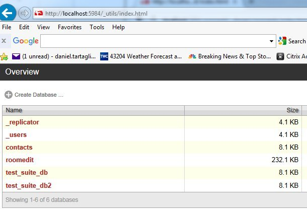
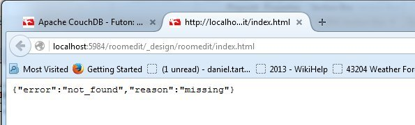
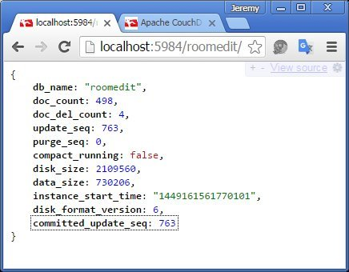
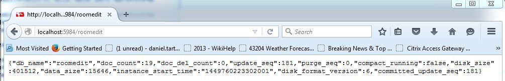

<head>
<title>The 3D Web Coder</title>
<meta http-equiv="Content-Type" content="text/html; charset=utf-8"/>
<link rel="stylesheet" type="text/css" href="3dwc.css"/>

<!--

-->
</head>

<!---

#adskdevnetwrk
#expressjs
#RestSharp
#Autodesk #IoT #SeeControl #cloud
#python #markdown #asciidoc
#gcal #caldav #googleapi
#milanojs
#3dwebaccel #prague #webgl #3dweb #a360
#au2015 #autocad #inventor #ah8 #cubeathens #developers
#aws #handlebars
#JsFiddle #Reactjs
#autodesku #rtceur
#Reactjs
#MongoDB
#mongolab
#Heroku
#restapi #nodejs #adsk
#javascript

akn_include

Autodesk Uni Cloud and Mobile Expert Panel #au2015 #3dwebcoder #revitapi #ViewAndDataAPI

Here are the notes I took at the Autodesk University 2015 panel discussion SD9731 &ndash; <i>Autodesk Cloud and Mobile API and Technologies: Meet the Experts</i>, led by Cyrille Fauvel, Senior Manager, ADN M&E, Autodesk Inc.
&ndash; Learning Objectives
&ndash; Description
&ndash; Your AU Expert
&ndash; Overview
&ndash; Panellists
&ndash; Questions and Answers...

-->

### Roomedit CouchDB Update

You may be aware of
the [roomedit CouchDB app](https://github.com/jeremytammik/roomedit) that I implemented for
my [2D real-time round-trip cloud-based RoomEditorApp](https://github.com/jeremytammik/RoomEditorApp).

Originally implemented in 2013, I migrated it to Revit 2016 for my class
on [connecting desktop and cloud](http://thebuildingcoder.typepad.com/blog/2015/11/connecting-desktop-and-cloud-room-editor-update.html) at
the Revit Technology Conference RTC Europe, and created a recording of
it [preparing to set up the AEC booth](http://thebuildingcoder.typepad.com/blog/2015/11/connecting-desktop-and-cloud-at-au-and-devdays.html) at
Autodesk University.

My colleague [Jaime Rosales Duque](http://adndevblog.typepad.com/aec/jaime-rosales.html) had some issues setting up roomedit on his machine, I struggled with the same, and
finally [@DanTartaglia66](https://twitter.com/DanTartaglia66) joined the club, as you can see from our discussion in
a [series of blog post comments](http://thebuildingcoder.typepad.com/blog/2015/11/connecting-desktop-and-cloud-at-au-and-devdays.html#comment-2389427045).

The gist of all our discussions is that we were unable to find an easy way to upload the roomedit database definition files to CouchDB.

We tried [kanso](https://github.com/kanso/kanso) in various [flavours](http://kan.so), both on Windows and cygwin, replicating via IrisCouch, installing [Erica](https://github.com/benoitc/erica), which requires [Erlang](http://www.erlang.org), which is built into CouchDB anyway, and so on and so forth.

If you are really interested in the various convoluted details of these failed attempts, you can follow some of our them by studying our [email thread](files/couchdb_manso_erica.pdf) including lots of screen snapshots.

In the end, we followed the simplest possible advice given
on [how to make file system backups](https://wiki.apache.org/couchdb/How_to_make_filesystem_backups):

> There are three types of variable data files to backup:
>
> - Database files
> - Configuration files
> - Log files
>
> Actually, you can copy a live database file from the OS at anytime without problem. Doesn't matter if its being updated, or
> even if its being compacted, the CouchDB never-overwrite storage format ensures it should just work without issue.
>
> For all platforms, locate your database, configuration, and log files and perform a file system copy. Be careful to preserve file permissions, too. Archive these files to wherever you want &ndash; ideally on a different machine in a different physical location &ndash; with appropriate security limiting access.

I followed that advice and simply transferred the copy of my hard disk CouchDB database definition files
from `Program Files (x86)\Apache Software Foundation\CouchDB\var\lib\couchdb` to
the destination machine.

This solved the problem for Dan as well, and he suggested I share them with you too, so here they are, included below.

This is a summary of our conversation about this:

Dan: I cannot seem to get the Room Editor to display. I installed both the RoomEditorApp and Roomedit CouchDB, didn't change any code, all seems to work correctly, it's using the localhost. If I go to CouchDB and to Futon I see 'roomedit' but I cannot figure out how to see/get the Room Editor open.

Jeremy: Glad to hear of your interest.

Do you see the room editor in the couchdb management console?

<ul><li><a href="http://localhost:5984/_utils">http://localhost:5984/_utils</a></li></ul>

Then the room editor should appear at

<ul><li><a href="http://localhost:5984/roomedit/_design/roomedit/index.html">http://localhost:5984/roomedit/_design/roomedit/index.html</a></li></ul>

Dan: I see roomedit. The link you replied with does not work in any browser.

Jeremy: Oh dear, that is strange and unfortunate.

I see it at

<ul><li><a href="http://localhost:5984/roomedit/_design/roomedit/index.html">http://localhost:5984/roomedit/_design/roomedit/index.html</a></li></ul>

Then, as I navigate through the project - level - room hierarchy, I move on to:

<ul><li><a href="http://localhost:5984/roomedit/_design/roomedit/index.html?modelid=bf0552b6-b7f7-4331-96d5-b19843262895-00015084">http://localhost:5984/roomedit/_design/roomedit/index.html?modelid=bf0552b6-b7f7-4331-96d5-b19843262895-00015084</a></li></ul>

<ul><li><a href="http://localhost:5984/roomedit/_design/roomedit/index.html?levelid=e3e052f9-0156-11d5-9301-0000863f27ad-00000137">http://localhost:5984/roomedit/_design/roomedit/index.html?levelid=e3e052f9-0156-11d5-9301-0000863f27ad-00000137</a></li></ul>

<ul><li><a href="http://localhost:5984/roomedit/_design/roomedit/index.html?roomid=2c208b33-13f4-4e37-a4ba-2fe92782be83-00034629">http://localhost:5984/roomedit/_design/roomedit/index.html?roomid=2c208b33-13f4-4e37-a4ba-2fe92782be83-00034629</a></li></ul>

I would have expected that it automatically work once you see it in the CouchDB utils console.

What do you see in the browser JavaScript debugging console?

Dan: I've attached all the images. Am I missing something? Thanks for the help and time.

Jeremy: How about this simpler URL?

<ul><li><a href="http://localhost:5984/roomedit">http://localhost:5984/roomedit</a></li></ul>

What does that return?

Look at my result below.

Dan: It returns this JSON:

<pre>
{"db_name":"roomedit","doc_count":19,"doc_del_count":0,"update_seq":181,"purge_seq":0,"compact_running":false,"disk_size":401512,"data_size":15646,"instance_start_time":"1449760223302001","disk_format_version":6,"committed_update_seq":181}
</pre>

Here is a screen snapshot:

Jeremy: That looks pretty good, actually. At least the database is there. On other hand, maybe it is something you set up yourself in a different manner, and maybe the appropriate design documents, such as index.html, are missing.

How did you set up the database, i.e., transfer the roomedit database definition from the files on the hard disk into CouchDB?

Dan: I honestly do not remember, guess I'm getting old :-(.

Jeremy: Jaime and I had quite a struggle doing so setting up the AEC booth at AU.

In the end, we copied a zip file of my existing database definition onto the new machine.

We could not get Kanso et al to work.

Dan: Is it possible to get your zipfile or would that not help?

Jeremy: Sure I can send you that. Here
is [roomedit_couchdb.zip](files/roomedit_couchdb.zip) containing all you need.

I created it using this command line:

<pre>
C:\>zip -r roomedit_couchdb "Program Files (x86)\Apache Software Foundation\CouchDB\var\lib\couchdb"
</pre>

Note that it includes the full path, so unpack it carefully, e.g. in a temporary directory, then move the files to your couchdb installation.

Dan: Works fine with your db files, all I had to do is overwrite mine and all worked correctly. I’m pretty sure I followed your original instructions and the info on Couch website. You may want to post the files on your blog for others.

Thanks for your time and all your help!
