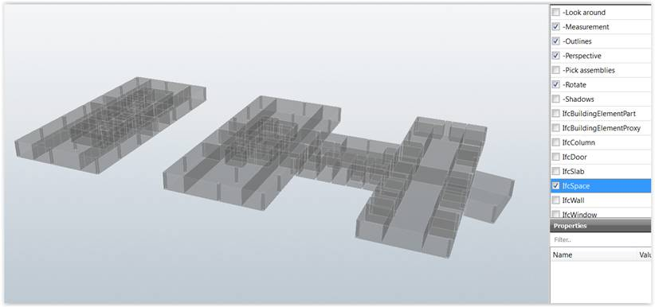

<head>
<title>The 3D Web Coder</title>
<meta http-equiv="Content-Type" content="text/html; charset=utf-8"/>
<link rel="stylesheet" type="text/css" href="3dwc.css"/>

<!--

-->
</head>

<!---

#adskdevnetwrk
#expressjs
#RestSharp
#Autodesk #IoT #SeeControl #cloud
#python #markdown #asciidoc
#gcal #caldav #googleapi
#milanojs
#prague
#au2015 #autocad #inventor #ah8 #cubeathens #developers
#aws #handlebars
#JsFiddle #Reactjs
#autodesku #rtceur
#Reactjs
#MongoDB
#mongolab
#Heroku
#restapi #nodejs #adsk
#javascript
#au2015 #autodesku #rtceur #SVG #javascript

akn_include

How to View a Space and Exciting Times Ahead #3dwebcoder #revitapi #3dweb #a360 #3dwebaccel #webgl @adskForge

Today, let's recapitulate a discussion on viewing architectural spaces in the View and Data API, plus take a look at all the exciting things happening both for myself in the next weeks and for Autodesk as a company as a whole, reinventing itself for the modern cloud-based collaborative sharing technoculture
&ndash; The first annual Autodesk X summit
&ndash; Jeremy's January
&ndash; DevDay in Munich
&ndash; Accelerator Workshop
&ndash; BIM Workshop in Madrid
&ndash; Viewing IFC spaces and models...

-->

### How to View a Space and Exciting Times Ahead

Today, let's recapitulate a discussion on viewing architectural spaces in the View and Data API, plus take a look at all the exciting things happening both for myself in the next weeks and for Autodesk as a company as a whole, reinventing itself for the modern cloud-based collaborative sharing technoculture:

- [The first annual Autodesk X summit](#2)
- [Jeremy's January](#3):
    - [DevDay in Munich](#4)
    - [Accelerator Workshop](#5)
    - [BIM Workshop in Madrid](#6)
- [Viewing IFC spaces and models](#7)

#### The First Annual Autodesk X Summit

You may have noticed a global trend towards more openness, collaborativity, sharing, community building in software and other businesses as well.

I hope you are taking note and embracing this for yourself, just as I am.

As we embark on this new year 2016, Autodesk is going through a time of unprecedented change in every way. Although change is challenging, and at times uncomfortable, we are truly excited to be on this journey with you.

You can get an impression of some of the directions we are headed by taking a look at

[xsummit.autodesk.com](http://xsummit.autodesk.com)
 This experience works best when viewed in Chrome

Last October, we held our first annual Autodesk X Summit.

This event marked an exciting moment in Autodesk history &ndash; the beginning of the era of experiences over technologies.   As we transform from a company that sells software products to companies into a platform company that offers services and solutions, we have to place human-centred experience design at the heart of our work and company culture to be successful.  This new way of working cannot involve only those in the traditional design or experience roles  &ndash; delivering excellent experiences for our customers is a shared responsibility for every one of us.

In this spirit, the Autodesk X Summit was broadly inclusive, and gathered designers, engineers, architects, product leaders, customer advocates, salespeople, and makers from all across the company and the globe.  This event marked the beginning of our connected culture, our experience-led era, that binds us all together.

We curated some of the best content and highlights of the event into a virtual experience which will give you a sense of what happened at the X Summit, and hopefully inspire you to find ways to start to design, connect & lead in your own work.

I invite you to explore the experience, watch the videos, and join this transformation.
I am excited to work together with you in 2016 and moving forward.

#### Jeremy's January

I will be travelling quite a bit in the next couple of weeks, but only to places beginning with the letter 'M'.

I would love to run into you at one of the venues listed below.

#### DevDay in Munich

This year, we will be holding just one single DevDay conference in Europe, in Munich on Monday January 18.

Attending DevDays is the best way for you to keep abreast of, and maintain compatibility with, new Autodesk web service and desktop technologies.

DevDays has always been about looking at our newest products, features, and services.

As always, you will see and learn about the upcoming enhancements in the desktop platform capabilities and APIs.

This year, we will also cover the Autodesk Forge Cloud Services, providing a technology and business platform for a new generation of connected Cloud, Web and Mobile apps and based on our web services such as View & Data, AutoCAD I/O, Fusion 360, BIM 360, ReCap 360, and InfraWorks 360.

For the web service APIs, the learning curve is steep, and a few hours during a DevDay conference is just not enough.

Therefore, new for this year, we are appending a four day abbreviated form of
the [Autodesk Cloud Accelerator](http://autodeskcloudaccelerator.com) program, cf. [below](#5).

Registration is easy.  Simply visit the event website at [autodeskdevdays.com](http://www.autodeskdevdays.com) &gt; [Munich](http://autodeskdevdays.com/munich-3) for full information and click
on [Register Now](https://www.eventbrite.com/e/devdays-20152016-tickets-18549596342).

If you have any questions about this event, please don't hesitate to contact us
at [devdaysinfo@autodesk.com](mailto:devdaysinfo@autodesk.com).

Please keep in mind that part of material at Developer Days is forward-looking and confidential, so you will be required to sign a non-disclosure agreement to attend.

#### Accelerator Workshop

As said, you can extend your and deepen your exploration of the Autodesk web services by staying on after the DevDay conference and participating in all or part of a four day abbreviated form of
the [Autodesk Cloud Accelerator](http://autodeskcloudaccelerator.com) program.

The Accelerator workshops provide an unparalleled opportunity for you to learn and work intensively on your chosen project with direct face-to-face help, support and training from Autodesk Cloud Engineering experts.

Invest a few days now &ndash; you will save precious development time later and significantly accelerate your learning curve and project development.

#### BIM Workshop in Madrid

Directly after the DevDay conference and accelerator workshop, I will head off to Madrid for
the [BIM Programming Workshop](http://www.bimprogramming.com) there.

As the name implies, it is focused on architectural programming and dives into both desktop and web based aspects, including hands-on workshops exploring
the [Revit](http://www.autodesk.com/developrevit)
and [View and Data](https://developer.autodesk.com) APIs.

To explore the detailed agenda and register for the workshops, please
visit <b>[bimprogramming.com](http://www.bimprogramming.com)</b>.

#### Viewing IFC spaces and models

One of the questions that arose in preparation for the cloud accelerator in Munich has to do with viewing spaces in IFC and other architectural environments:

**Question:** I registered for the Munich DevDay and accelerator and would like to clarify some of my main points of interest and open questions regarding the View and Data API beforehand.

I hope that at the meeting I will get support and further information, e.g., on the following:

1. Is it possible to show the IfcSpace objects in the View and Data client? At least with the default settings, this seems to be impossible, even when the data for the graphical representation of the spaces (rooms) is included in the IFC model.

2. Is it possible to combine several separate IFC models in the same viewer? For example, one use case could be having separate IFC models for each building’s storey and for Architectural, Electrical and Mechanical designs. The user would like to combine these models in the viewer as needed, e.g., choosing exactly which combination of building levels, storeys, disciplines, etc. to display. According to the documents and examples this currently does not seems to be supported, and only one model at a time can be loaded in the viewer.

3. Is it possible to have a programmatic access to the (usually) 'non visible' content of the IFC models in the viewer API, for example IfcBuilding, IfcBuildingStorey, IfcSpace, IfcSystem, IfcZone, etc.?

For the sake of completeness, here are two IFC links:

- [BuildingSmart](http://www.buildingsmart-tech.org)
- [IFC schemas](http://www.steptools.com/support/stdev_docs/express/ifc2x3/html)

I already implemented prototypes using the View and Data API and would appreciate getting further advice and support including these topics at the Munich meeting.

**Answer:** Here is some initial feedback on this:

1. The question on IfcSpace is similar to the issue with rooms in Revit. They are also not displayed by the viewer, since there is nothing to display for them. Please check out the related thread
on [Revit rooms](http://forums.autodesk.com/t5/view-and-data-api/revit-rooms/m-p/5836383) in
the View and Data API discussion forum.

2. Yes, combining models is now possible. This area is still being worked on, however. We can say more about this and help you in this area at the accelerator.

3. Yes. Each translator decides for itself what objects are included in the viewer stream. The Revit translator includes many invisible objects, and they are all programmatically accessible. For the IFC objects you refer to, it would depend on the translator you use and require checking on a case by case basis.

4. In general, you can ask these kind of questions on
the [View and Data API discussion forum](http://forums.autodesk.com/t5/view-and-data-api/bd-p/95) as well.
That will address a larger audience.
More of your peers will see it, be able to chip in and help, and more people will see and be able to profit from the answers provided as well.

I look forward to exploring these questions further together in Munich.

**Response:**

1. Yes, I had already seen that thread in the discussion forum, but I still feel that there is something missing. The IFC models contain objects of
type [IfcSpace that *do* have a geometric representation](http://www.buildingsmart-tech.org/ifc/IFC2x3/TC1/html/ifcproductextension/lexical/ifcspace.htm).
They are displayed graphically by several IFC viewer applications and i.m.o should also be shown in the View and Data viewer:

2. This is great news! Combining models is quite crucial for the use cases that I’m investigating currently.
3. If I understood correctly this would be the responsibility of the View and Data server’s 'registration' process. I did not manage to get access to the Storey, Space or System objects. Perhaps the registration/translation functionality will be enhanced in the future?
4. Yes, I will publish my next questions to the discussion forum and you can of course publish our current discussion there, also.
