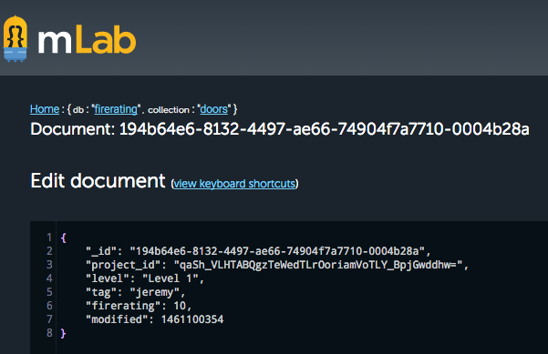

<head>
<title>The 3D Web Coder</title>
<meta http-equiv="Content-Type" content="text/html; charset=utf-8"/>
<link rel="stylesheet" type="text/css" href="3dwc.css"/>

<!--

-->
</head>

<!---

FireRatingCloud Document Modification Timestamp #3dwebcoder #revitapi #3dweb @adskForge #adsk #RestSharp #nodejs

The last task I discussed here was the FireRatingCloud batch upload functionality.
FireRatingCloud is a C# .NET Revit API add-in REST API MongoDB client of the fireratingdb node.js MongoDB web server.
The details of the research and development for this project is extensively documented in the FireRatingCloud GitHub repository.
The batch upload vastly improves the upload speed, since an upload of N records is reduced from N separate REST API calls to a constant 2...

-->

### FireRatingCloud Document Modification Timestamp

The last task I discussed here was
the [FireRatingCloud](https://github.com/jeremytammik/FireRatingCloud)
[batch upload functionality](http://the3dwebcoder.typepad.com/blog/2016/03/fireratingcloud-rest-api-batch-upload-and-windows-client.html).

FireRatingCloud is a C# .NET Revit API add-in REST API MongoDB client of
the [fireratingdb](https://github.com/jeremytammik/firerating)
[node.js](https://nodejs.org)
[MongoDB](https://www.mongodb.org) web server.

The details of the research and development for this project is extensively documented in
the [FireRatingCloud GitHub repository](https://github.com/jeremytammik/FireRatingCloud).

The batch upload vastly improves the upload speed, since an upload of N records is reduced from N separate REST API calls to a constant 2 &ndash; one to delete existing records, and the second to batch upload all the new ones.

Another piece of functionality that I wish to implement for the FireRatingCloud sample is a real-time update, where the Revit add-in can poll the database for any changes that affect the current project, to read them back and update the BIM automatically in real-time.

I implemented something similar in my previous cloud database sample,
the [RoomEditorApp](https://github.com/jeremytammik/RoomEditorApp) cloud-based, real-time, round-trip, 2D Revit model editor.

It communicates with
the [roomeditdb](https://github.com/jeremytammik/roomedit)
[CouchDB](https://couchdb.apache.org) database, and the latter returns a sequence number on each database modification.

I used the sequence number to determine which database record have changes since the last check, and hence need to be downloaded to update the BIM.

MongoDB does not provide such a built-in sequence number, so I have to implement something to replace it myself.

Here are the steps that I took on this quest:

- [Updating the database schema](#2)
- [Using the `$currentDate` operator](#3)
- [Setting schema timestamps to true](#4)
- [Implementing my own timestamp in C#](#5)
- [Download](#6)

As far as I can tell from a couple of quick internet searches, the easiest and most common approach seems to be to attach a 'last modification' timestamp to each document.

Let's go ahead and try that out.

Here are some StackOverflow search results that I encountered, initially on adding a timestamp:

- [How to retrieve modified documents after an update operation in mongodb](http://stackoverflow.com/questions/19355525/how-can-i-retrieve-modified-documents-after-an-update-operation-in-mongodb-with)
- [Mongo db default timestamp](http://stackoverflow.com/questions/36550263/mongo-db-default-timestamp)
- [MongoDB/Mongoose querying at a specific date](http://stackoverflow.com/questions/11973304/mongodb-mongoose-querying-at-a-specific-date)

That led me on to look further at automatic timestamp update on modification:

- [How to auto update a timestamp on upsert in Mongodb](http://stackoverflow.com/questions/20447257/how-to-auto-update-a-timestamp-on-upsert-in-mongodb)
- [How to update a property with the current date in a Mongoose schema on every save](http://stackoverflow.com/questions/7675549/how-do-i-update-a-property-with-the-current-date-in-a-mongoose-schema-on-every-s)

#### Updating the Database Schema

The mongo data model for a Revit door instance is defined by the door schema in `model/door.js`.

I could add a `modified` field to it like this:

<pre class="prettyprint">
var doorSchema = new Schema(
  { _id          : RvtUniqueId // suppress automatic generation
    , project_id : String
    , level      : String
    , tag        : String
    , firerating : Number
    , modified   : Date },
  { _id: false } // suppress automatic generation
);
</pre>

However, on reading a bit further, I suspect that it might be possible to avoid explicitly adding the field myself after all.

#### Using the $currentDate Operator

Reading through [how to auto update a timestamp on upsert in mongodb](http://stackoverflow.com/questions/20447257/how-to-auto-update-a-timestamp-on-upsert-in-mongodb)
and the mongo documentation on
the [`$currentDate` operator](https://docs.mongodb.org/master/reference/operator/update/currentDate),
it seems that I can simply add a call to the operator to all the database controller calls.

The lengthy discussion
on [pre and post middleware not being executed on findByIdAndUpdate](https://github.com/Automattic/mongoose/issues/964) sounds
rather scary, though.

However, apparently, an even simpler solution exists:

#### Setting Schema Timestamps to True

The discussions above led on
to [add `created_at` and `updated_at` fields to mongoose schemas](http://stackoverflow.com/questions/12669615/add-created-at-and-updated-at-fields-to-mongoose-schemas),
which mentions that

> You can now use the [#timestamps option](http://mongoosejs.com/docs/guide.html#timestamps) with mongoose version >= 4.0.

I removed the `modified` field and set the `timestamps` option instead:

<pre class="prettyprint">
var doorSchema = new Schema(
  { _id          : RvtUniqueId // suppress automatic generation
    , project_id : String
    , level      : String
    , tag        : String
    , firerating : Number },
  { _id          : false // suppress automatic generation
    , timestamps : true }
);
</pre>

After adding this, the batch update call added neither a `createdAt` nor an `updatedAt` field, but the `upsert` operation did indeed create the latter, at least:

<pre class="prettyprint">
{
  "_id": "194b64e6-8132-4497-ae66-74904f7a7710-0004b28a",
  "project_id": "qaSh_VLHTABQgzTeWedTLrOoriamVoTLY_BpjGwddhw=",
  "level": "Level 1",
  "tag": "jeremy",
  "firerating": 14,
  "updatedAt": {
    "$date": "2016-04-18T17:59:56.737Z"
  }
}
</pre>

This seems to be one of those typical web development scenarios where everything you need has already been implemented somewhere, but it is next to impossible &ndash; or seems rather hard to me, at least &ndash; to determine exactly where and how to use it fully.

In this case, some operations perform as expected, others do not, and the documentation is meagre and confusing.

I therefore opted to define my own timestamp in the C# code, to ensure complete control &ndash; mainly due to my incomplete understanding of MongoDB and Mongoose, of course.

#### Implementing My Own Timestamp in C#

In order to avoid any time and date confusion issues, I am opting to store my own Unix timestamp, i.e., the number of seconds since 1970-01-01.

I am storing it as an integer value, and not letting anyone know that it is in fact a timestamp, to hopefully ensure that all parties involved leave it alone and don't try to meddle with it in any way.

I added it to the base DoorData class like this:

<pre class="code">
&nbsp; public class DoorData
&nbsp; {
&nbsp; &nbsp; public string _id { get; set; }
&nbsp; &nbsp; public string project_id { get; set; }
&nbsp; &nbsp; public string level { get; set; }
&nbsp; &nbsp; public string tag { get; set; }
&nbsp; &nbsp; public double firerating { get; set; }
&nbsp; &nbsp; public int modified { get; set; }
&nbsp;
&nbsp;
&nbsp; &nbsp; /// &lt;summary&gt;
&nbsp; &nbsp; /// Constructor to populate instance by 
&nbsp; &nbsp; /// deserialising the REST GET response.
&nbsp; &nbsp; /// &lt;/summary&gt;
&nbsp; &nbsp; public DoorData()
&nbsp; &nbsp; {
&nbsp; &nbsp; }
&nbsp; }
</pre>

I determine the Unix timestamp using this helper method:

<pre class="code">
&nbsp; /// &lt;summary&gt;
&nbsp; /// Gets a Unix timestamp representing 
&nbsp; /// the current moment, i.e., the number 
&nbsp; /// of seconds since 1970-01-01.
&nbsp; /// &lt;/summary&gt;
&nbsp; public static int UnixTimestamp()
&nbsp; {
&nbsp; &nbsp; return (int) Math.Truncate(
&nbsp; &nbsp; &nbsp; DateTime.UtcNow.Subtract( _1970_01_01 )
&nbsp; &nbsp; &nbsp; &nbsp; .TotalSeconds );
&nbsp; }
</pre>

I can set the `modified` value in the `DoorData` constructor:

<pre class="code">
&nbsp; modified = Util.UnixTimestamp();
</pre>

The mongoose schema definition to hold it now looks like this:

<pre class="prettyprint">
var doorSchema = new Schema(
  { _id          : RvtUniqueId // suppress automatic generation
    , project_id : String
    , level      : String
    , tag        : String
    , firerating : Number
    , modified   : Number },
  { _id          : false } // suppress automatic generation
);
</pre>

The document stored in the mongo database according to this schema looks exactly as expected:

<pre class="prettyprint">
{
  "_id": "194b64e6-8132-4497-ae66-74904f7a7710-0004b28a",
  "project_id": "qaSh_VLHTABQgzTeWedTLrOoriamVoTLY_BpjGwddhw=",
  "level": "Level 1",
  "tag": "jeremy",
  "firerating": 12345,
  "modified": 1461099506
}
</pre>

Obviously, anyone who updates the database entries is now responsible for explicitly setting the correct `modified` value as well.

Using the built-in mongo functionality to do it automatically would be more comfortable, but how to reliably achieve that is unclear to me at the moment.

Now the path is open to start implementing the real-time BIM update by polling the database for all records belonging to the current project modified since they were last checked.

#### Download

The current versions
of [FireRatingCloud](https://github.com/jeremytammik/FireRatingCloud)
and [fireratingdb](https://github.com/jeremytammik/firerating) discussed above
are [release 2016.0.0.24](https://github.com/jeremytammik/FireRatingCloud/releases/tag/2016.0.0.24)
and [release 0.0.20](https://github.com/jeremytammik/firerating/releases/tag/0.0.20),
respectively.
