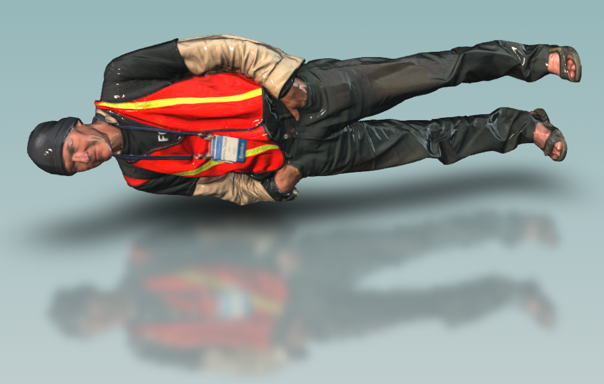
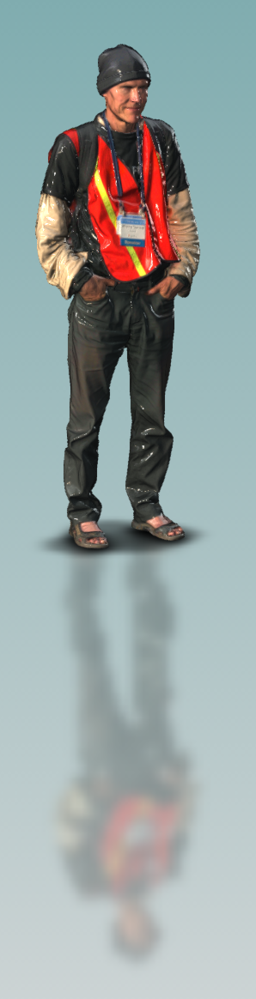

<head>
<title>The 3D Web Coder</title>
<meta http-equiv="Content-Type" content="text/html; charset=utf-8"/>
<link rel="stylesheet" type="text/css" href="3dwc.css"/>
<!--

-->

</head>

<!---

Flipping OBJ Axes and OBJ Texture for Forge #3dwebcoder #revitapi @AutodeskForge #ForgeDevCon

The Forge DevCon finished.
I had a full body 3D scan created in the Shapify Booth there.
The resulting OBJ model can be downloaded for $10 from shapify.me.
It includes the material and texture files.
Unfortunately, the initial model is lying down, not standing up:
&ndash; Flipping the OBJ Axes using sed...

-->

### Flipping OBJ Axes and OBJ Texture for Forge

The [Forge DevCon](http://forge.autodesk.com/conference) finished, and I spent a nice weekend walking around San Francisco.

Saturday, I crossed the Golden Gate bridge and the Marin headlands to Sausalito:

Sunday, I participated in
the [ecstatic dance event](http://ecstaticdance.org/SF)
([FB](https://www.facebook.com/groups/EcstaticSF)) in their great new location and enjoyed the views from
the [Buena Vista](http://sfrecpark.org/destination/buena-vista-park)
and [Presidio](https://en.wikipedia.org/wiki/Presidio_Park) parks:

At the Forge DevCon, I had
a [full body 3D scan](https://www.artec3d.com/events/autodesk-forge-devcon-2016) created in
the [Shapify Booth](https://www.artec3d.com/hardware/shapifybooth).

The resulting OBJ model can be downloaded for $10 from [shapify.me](https://shapify.me).

It includes the material and texture files. The material is initially set to very shiny, to match the plastic figurine that you can have printed out.

Unfortunately, the initial model is lying down, not standing up:

Lying down, it is kind of hard to manipulate in a meaningful fashion.

I uploaded that initial model to both
the [Dotty trial](http://trial.dotdotty.com/#/viewer?id=576449c558680a96580fa228)
and [A360](http://a360.co/28MmpuN) platforms
for you to test the rotation behaviour in that orientation.

####Flipping the OBJ Axes using `sed`

Happily, it is easy to change the axis definitions in the OBJ file using a simple `sed` operation.

I case you are not familiar with it, `sed` is the age-old [stream editor](https://en.wikipedia.org/wiki/Sed) Unix text processing utility, developed at Bell labs in 1973-1974.

It is available for just about any operating system, and already built in to every Unix, Linux or Mac OS shell.

You can easily install `sed` on other operating systems, including Windows.

Now, how can `sed` help us flip the figure to stand up?

To flip the figure from lying to standing, we need to modify two of the three cardinal axes:

- `X` &ndash; leave unchanged
- `Y` &ndash; replace by the `Z` value
- `Z` &ndash; replace by the `-Y` value

By the way, the negation is required to conserve the 'handedness' of the surface triangles.

The rendering system assumes them to be oriented in a specified direction, based on a right-handed coordinate system.

Not flipping the sign would convert the right-handed system to a left-handed one, invert the triangle orientation, and corrupt the rendering.

In the OBJ file, each vertex is defined in a line of text like these:

<pre>
v -87.852317810058594 -89.117828369140625 25.285612106323242
v 166.26298522949219 197.78297424316406 1084.01806640625
v -29.722711563110352 307.6329345703125 1215.2177734375
</pre>

The transformation required is achieved by the following `sed` script:

<pre>
s/^v \([0-9\.\-]*\) \([0-9\.\-]*\) \([0-9\.\-]*\)/v \1 \3 -\2/
</pre>

In clear text, it says the following:

- `s` stands for 'substitute'
- `s/A/B/` means 'search for the expression `A` and replace it by `B`'
- `^v` means 'find a `v` at the beginning of the line followed by a space'
- That is followed by the first regular number, delimited by `\(` and `\)`, representing the `X` coordinate
- The expression consists of as many characters as possible from the set `0-9`, dot `.` and minus `-`
- That is followed by another space, followed by the second expression capturing the `Y` coordinate
- Ditto for `Z`
- Every time a search expression matching the specified pattern is encountered, it is replaced by `v \1 \3 -\2`, i.e., the original `v` character, the `X` value, the `Z` value, and the `Y` value with a prepended minus

Since the original `Y` value may be negative, and the replacement expression prepends another minus character to it, we may end up with two minus characters in front of the `Z` value.

Another simple substitution statement clears that up:

<pre>
s/ --/ /
</pre>

Meaning, 'replace space-minus-minus by just a space'.

I stored these two lines in a file `obj_flip_axes.sed`:

<pre>
s/^v \([0-9\.\-]*\) \([0-9\.\-]*\) \([0-9\.\-]*\)/v \1 \3 -\2/
s/ --/ /g
</pre>

The original OBJ file can be transformed to create a new one with flipped axes by running `sed` from the command line like this:

<pre>
$ sed -f obj_flip_axes.sed model__0.obj
</pre>

The result is printed to the command line.

The output can be directed to a new OBJ file like this:

<pre>
$ sed -f obj_flip_axes.sed model__0.obj &gt; model_flipped.obj
</pre>

In my case, the OBJ file size exceeds 57 MB, and this operation takes less than a second, so it is pretty efficient.

The resulting model is correctly oriented:

The interactive behaviour now is much better.

You can try this out for yourself as well.

Here it is again in
the [Dotty trial](trial.dotdotty.com/share?shareId=cdc9-523f-305f-7ddb-5cc4)
and on [A360](http://a360.co/21rt4OK) including the option to embed it:

<iframe src="https://myhub.autodesk360.com/ue29c31db/shares/public/SHabee1QT1a327cf2b7a7879b97973545818?mode=embed" width="420" height="315" allowfullscreen="true" webkitallowfullscreen="true" mozallowfullscreen="true"  frameborder="0"></iframe>

####Uploading OBJ with Material and Textures to Forge

This more or less answers the question
on [how to upload OBJ with MTL and textures to bucket](http://stackoverflow.com/questions/37912099/how-to-upload-obj-with-mtl-and-textures-to-bucket/37929809#37929809):

**Question:** As the title suggests, how do I upload the obj model's material file and textures, as they are hard coded in the obj file?

Can I upload the zipped dir structure or multiple files that are in correct relation (because of the hard coded nature of obj)?

**Answer:** A ZIP file should work for Autodesk Model Derivative as long as the same works locally (meaning all references are working).

For the sample above, I simply uploaded a single zip file containing OBJ, MTL and PNG to the Dotty trial site.

The upload to A360 was performed by uploading the parent folder and specifying the OBJ file as the main model.
